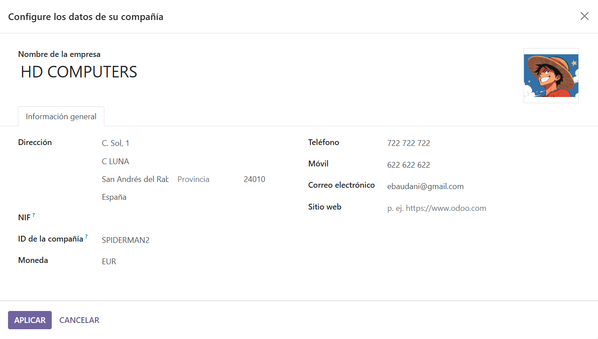
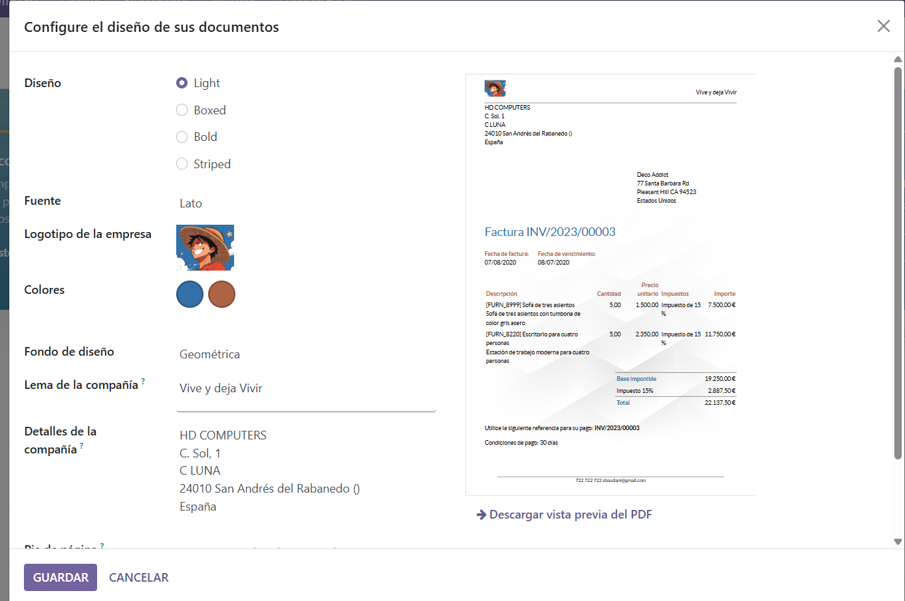
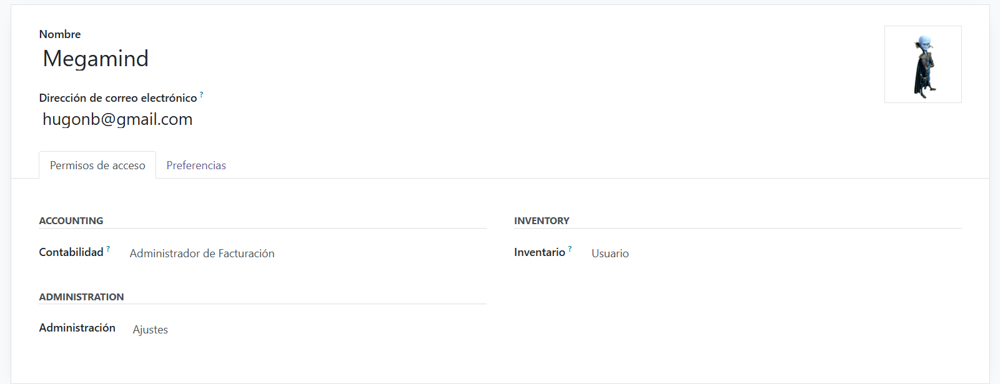
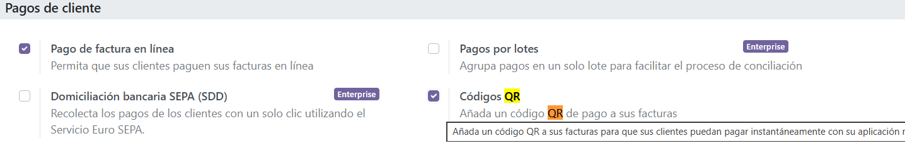
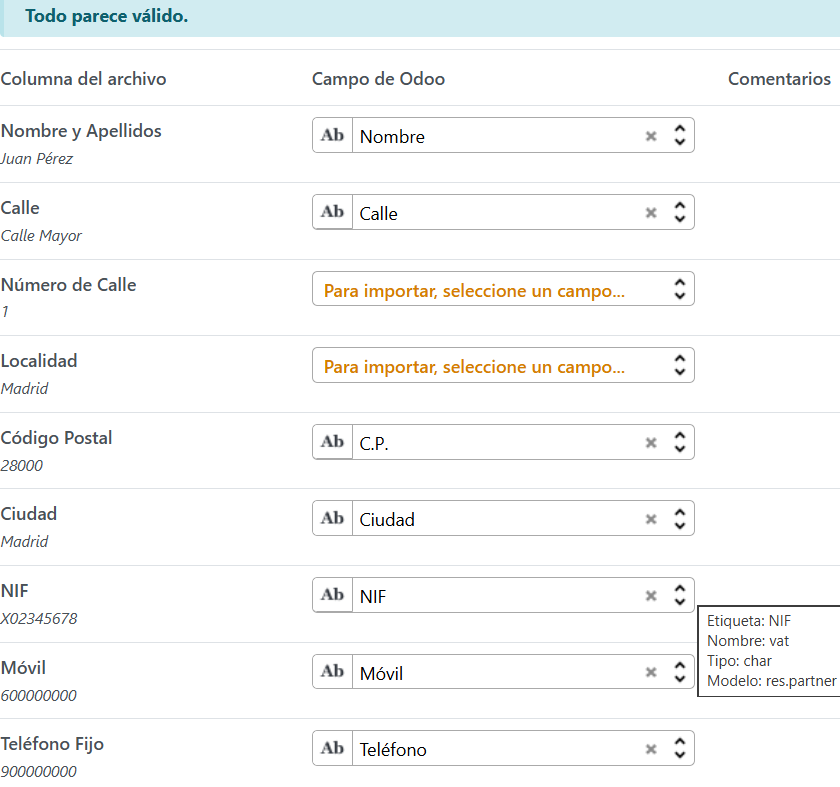
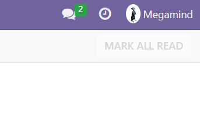
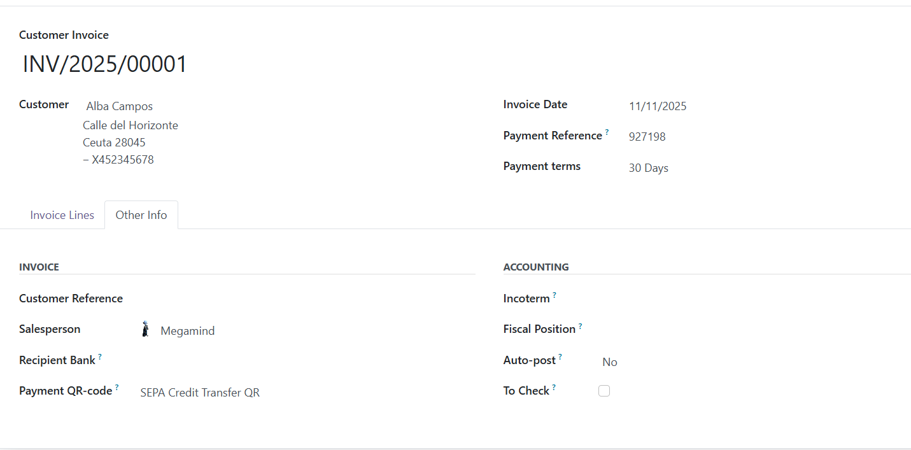

# PROYECTO DE FACTURACIÓN

En primer lugar rellenamos los campos iniciales

A continuacion rellenamos los siguinetes datos y editamos el tema

Creamos el segundo usuario

infromacion del usuario

activamos el qr

Una vez importamos todos los registros rellenamos tdoos los campos

Aqui tenemos todos los clientes

Ahora nos logueamos con Megamind

INFORMACIÓN DE LA FACTURA ¡

Ruta fichero pdf

[pdf](INV_2025_00001.pdf)