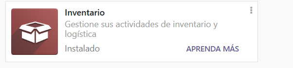
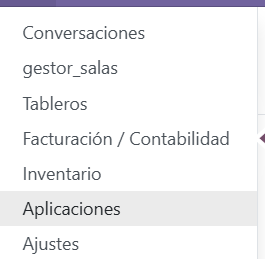
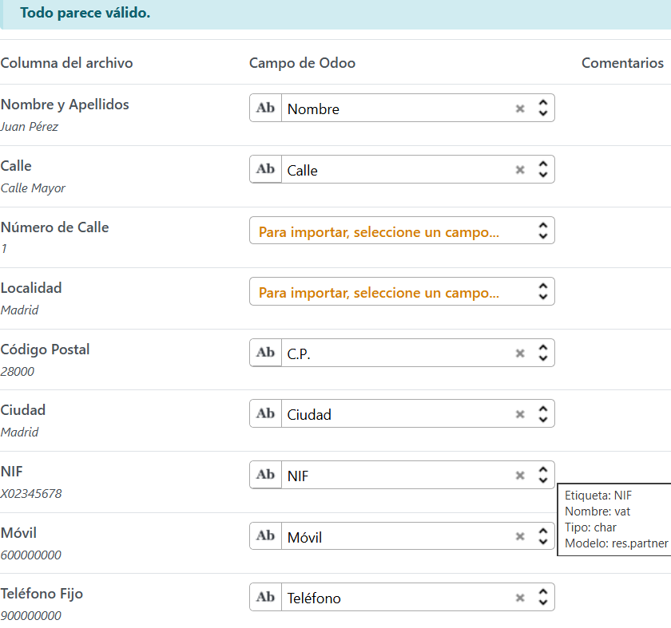
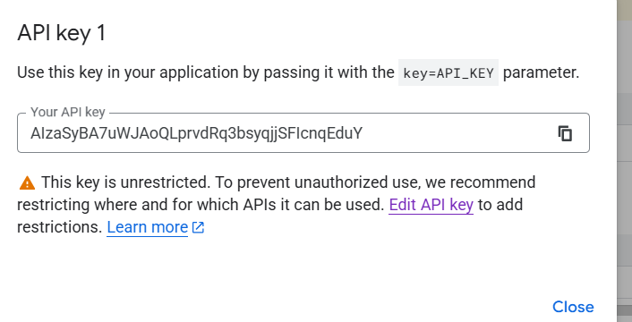
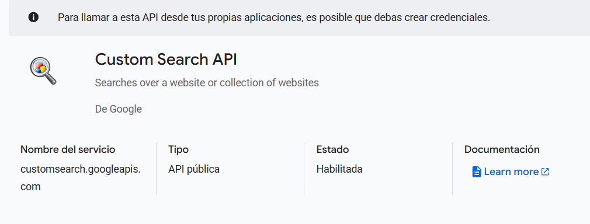
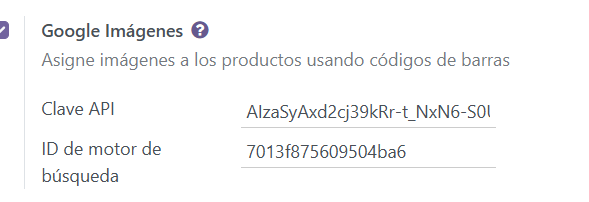

# Práctica de Integración de servicios externos

Primer de todo importamos el módulo de "Inventario"

Después de tener instalado el módulo nos dirigimos a inventario

Luego nos dirigimos a Productos -> Favoritos -> Importar registros -> Ahi importamos el fichero que nos ha facilitado el profesor

Después de rellenar los campos (El cual el más importante es el EAN ya que tendrá el código de barras y para las búsquedas google buscarás las imágenes según este código) buscaremos la api

Despues habilitamos la API

Obtenemos tambien el ID de búsqueda

Una vez tenemos esto simplemente nos dirigimos a los ajustes de Odoo -> Habilitamos Google imagenes -> Despues introducimos los dos datos que hemos obtenidos anteriormente

Después Guardamos lso cambios, Elegeimos nuestros productso -> Accion -> Generar las imágenes

