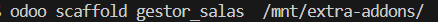
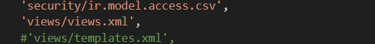
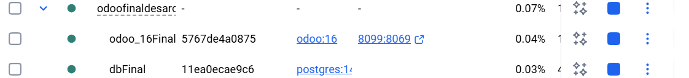
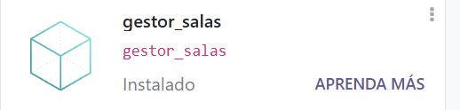
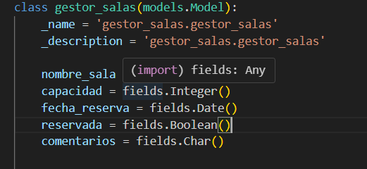
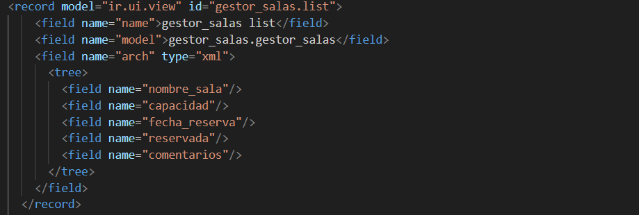
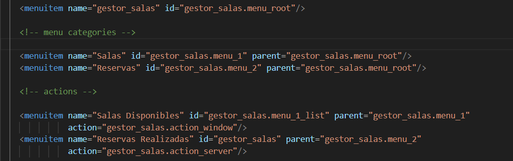
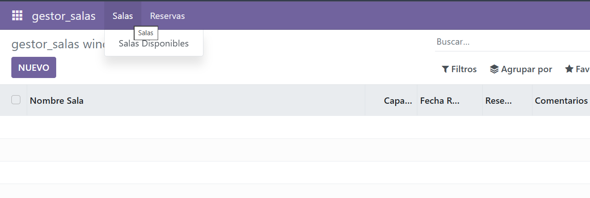
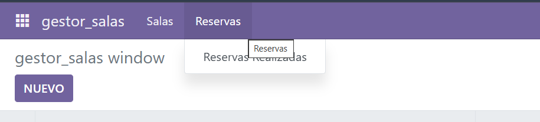

# Creación de un módulo básico

En primer lugar tenemos que crear el módulo. En nuestro caso debemos situarnos desde consola e introducir primero el siguiente comando : "docker exec -t -i id_contenedor bash"

Una vez hecho esto podremos "simular" que estamos en linux, de esta manera tyenemos que crear como tal el modulo que se hace con el siguiente comando : 


Una vez hecho esto ya tendremos creado nuestro primer módulo, por defecto en el arbol del proyecto tenemos directorios y ficheros dentro de ellos, lo que tendremos que hacer es descomentar cada uno de ellos. En el caso del manifest tenemos que dejar una parte de la siguiente manera: 



Ahora iniciamos el servidor 





Una vez iniciado debemos activar el modo desarollador, una vez activado damos en "Actualizar lista de aplicaciones" y después buscamos el nombre de nuestro módulo y lo instalamos: 




Ahora que ya tenemos el modulo instalado tenemoms que cumplir con lo que nos pide el enunciado, en primer lugar cada sala tiene consigo diferentes campos, los añadimos en el modelo 




Una vez añadido los campos debemos irnos al fichero vies.xml y hacer referencia a ellos 





Después de haber hecho las correspondientes referencias debemos hacer los menús, para ello la estructura de mnús quedaría de la siguiente manera




De esta forma los menús hacen referencia a otros pudiendo anidarse gracias a la referencia de sus ID, para poder ver que ha funcionado vamos a probarlo, para ello deberemos volver a Odoo y actualizar la apliación : 







De esta forma hemos podido crear los menú con éxito.


PARTE DEL CÓDIGO: 

```python
#Archivo models.py
from odoo import models, fields, api


class gestor_salas(models.Model):
    _name = 'gestor_salas.gestor_salas'
    _description = 'gestor_salas.gestor_salas'

    nombre_sala = fields.Char()
    capacidad = fields.Integer()
    fecha_reserva = fields.Date()
    reservada = fields.Boolean()
    comentarios = fields.Char()

    @api.depends('value')
    def _value_pc(self):
        for record in self:
            record.value2 = float(record.value) / 100
 ```

 ```xml
 #Archivo views.xml      
 <odoo>
  <data>
  <!-- explicit list view definition -->
  <record model="ir.ui.view" id="gestor_salas.list">
      <field name="name">gestor_salas list</field>
      <field name="model">gestor_salas.gestor_salas</field>
      <field name="arch" type="xml">
        <tree>
          <field name="nombre_sala"/>
          <field name="capacidad"/>
          <field name="fecha_reserva"/>
          <field name="reservada"/>
          <field name="comentarios"/>
        </tree>
      </field>
    </record>


    <!-- actions opening views on models -->

    <record model="ir.actions.act_window" id="gestor_salas.action_window">
      <field name="name">gestor_salas window</field>
      <field name="res_model">gestor_salas.gestor_salas</field>
      <field name="view_mode">tree,form</field>
    </record>


    <!-- server action to the one above -->

    <record model="ir.actions.server" id="gestor_salas.action_server">
      <field name="name">gestor_salas server</field>
      <field name="model_id" ref="model_gestor_salas_gestor_salas"/>
      <field name="state">code</field>
      <field name="code">
      </field>
    </record>


    <!-- Top menu item -->

    <menuitem name="gestor_salas" id="gestor_salas.menu_root"/>

    <!-- menu categories -->

    <menuitem name="Salas" id="gestor_salas.menu_1" parent="gestor_salas.menu_root"/>
    <menuitem name="Reservas" id="gestor_salas.menu_2" parent="gestor_salas.menu_root"/>

    <!-- actions -->

    <menuitem name="Salas Disponibles" id="gestor_salas.menu_1_list" parent="gestor_salas.menu_1"
              action="gestor_salas.action_window"/>
    <menuitem name="Reservas Realizadas" id="gestor_salas" parent="gestor_salas.menu_2"
              action="gestor_salas.action_server"/>

  </data>
</odoo>
```      