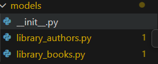
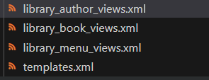
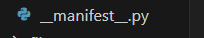
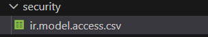
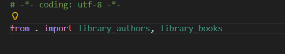
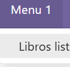
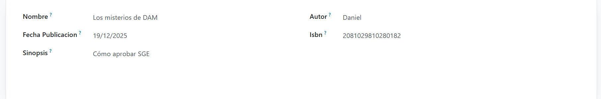
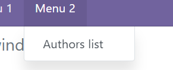
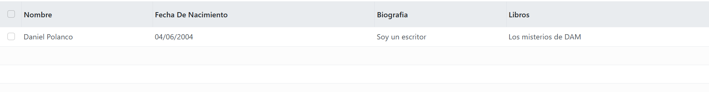

# Módulo con dos modelos

El objetivo en esta práctiva será crear un módulo con dos modelos, en este contexto será una Biblioteca la cual tendrá Autores y Libros.

Para comenzar este proyecto lo que tendremos que hacer será crear dos ficheros (library_authors, library_books) dentro de la carpeta models



Creamos la clase de cada uno la cual va a extender de Model y tendrán sus propios campos

```python
from odoo import models, fields, api


class library_authors(models.Model):
    _name = 'gestor_biblioteca.authors'
    _description = 'library_authors.library_authors'

    nombre = fields.Char()
    fecha_de_nacimiento = fields.Date()
    biografia = fields.Char()
    libros = fields.Text()

```

```python
from odoo import models, fields, api


class library_books(models.Model):
    _name = 'gestor_biblioteca.library_books'
    _description = 'library_books.library_books'

    nombre = fields.Char()
    autor = fields.Char()
    fecha_publicacion = fields.Date()
    ISBN = fields.Char()
    sinopsis = fields.Char()
```

Después de crear las clases, es decir los modelos hagamos las vistas, para ello debemos crear los siguientes xml en la carpeta templates




Este es el código de cada vista: 

Primero el de los autores : 

```xml
<odoo>
  <data>
  <!-- explicit list view definition -->
  <record model="ir.ui.view" id="gestor_biblioteca.authors_list">
      <field name="name">Authors list</field>
      <field name="model">gestor_biblioteca.authors</field>
      <field name="arch" type="xml">
        <tree>
          <field name="nombre"/>
          <field name="fecha_de_nacimiento"/>
          <field name="biografia"/>
          <field name="libros"/>
        </tree>
      </field>
    </record>


    <!-- actions opening views on models -->

    <record model="ir.actions.act_window" id="gestor_biblioteca.action_authors_window">
      <field name="name">gestor_biblioteca_authors_window</field>
      <field name="res_model">gestor_biblioteca.authors</field>
      <field name="view_mode">tree,form</field>
    </record>
  </data>
</odoo>
 ```

Ahora el de los libros :

```xml
<odoo>
  <data>
  <!-- explicit list view definition -->
  <record model="ir.ui.view" id="gestor_biblioteca.books_list">
      <field name="name">Authors list</field>
      <field name="model">gestor_biblioteca.library_books</field>
      <field name="arch" type="xml">
        <tree>
          <field name="nombre"/>
          <field name="autor"/>
          <field name="fecha_publicacion"/>
          <field name="ISBN"/>
          <field name="sinopsis"/>
        </tree>
      </field>
    </record>


    <!-- actions opening views on models -->

    <record model="ir.actions.act_window" id="gestor_biblioteca.action_books_window">
      <field name="name">gestor_biblioteca_books_window</field>
      <field name="res_model">gestor_biblioteca.library_books</field>
      <field name="view_mode">tree,form</field>
    </record>
  </data>
</odoo>
```
Ahora el del menú de arriba : 

```xml
<odoo>
  <data>
   
    <!-- Top menu item -->

    <menuitem name="gestor_biblioteca" id="gestor_biblioteca.menu_root"/>

    <!-- menu categories -->

    <menuitem name="Menu 1" id="gestor_biblioteca.menu_1" parent="gestor_biblioteca.menu_root"/>
    <menuitem name="Menu 2" id="gestor_biblioteca.menu_2" parent="gestor_biblioteca.menu_root"/>

    <!-- actions -->

    
    <menuitem name="Libros list" id="gestor_biblioteca.list_libros" parent="gestor_biblioteca.menu_1"
              action="gestor_biblioteca.action_books_window"/>
    <menuitem name="Authors list" id="gestor_authors" parent="gestor_biblioteca.menu_2"
              action="gestor_biblioteca.action_authors_window"/>

  </data>
</odoo>
```

Ahora nos dirigimos al manifest_py




Y añadimos las siguientes líneas


```python
# always loaded
    'data': [
        'security/ir.model.access.csv',
        'views/library_author_views.xml',
        'views/library_book_views.xml',
        'views/library_menu_views.xml',
        #'views/templates.xml',
    ],
```    

Po último nos dirigimos al directorio de seguridad y modificamos el archivo con extensión "csv" :




Añadimos lo siguiente 


```csv
id,name,model_id:id,group_id:id,perm_read,perm_write,perm_create,perm_unlink
access_library_authors,Library Authors Access,model_gestor_biblioteca_authors,base.group_user,1,1,1,1
access_library_books,Library Books Access,model_gestor_biblioteca_library_books,base.group_user,1,1,1,1 
```

MUY IMPORTANTE!!! -> En el fichero init debemos poner lo siguiente, sino nos va a dar un error 




Creamos un libro 






Creamos un autor



