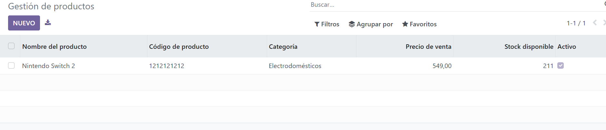

# UT06: Desarrollo de componentes: MVC y herencia

Esta práctica consiste en practicar los distintos tipos de campos que existen en odoo

Preparamos el modelo e introducimos los siguientes campos

```python
# -*- coding: utf-8 -*-

from odoo import models, fields


class GestionProductos(models.Model):
    _name = 'gestion_productos.gestion_productos'
    _description = 'Gestión de Productos'

    name = fields.Char(
        string='Nombre del producto',
        required=True
    )

    description = fields.Text(
        string='Descripción'
    )

    codigo_producto = fields.Char(
        string='Código de producto',
        required=True
    )

    imagen = fields.Image(
        string='Imagen del producto'
    )

    categoria = fields.Selection(
        [
            ('jardin', 'Jardín'),
            ('hogar', 'Hogar'),
            ('electrodomesticos', 'Electrodomésticos'),
        ],
        string='Categoría'
    )

    producto_destacable = fields.Boolean(
        string='Producto destacable'
    )


    precio_venta = fields.Float(
        string='Precio de venta'
    )

    stock_disponible = fields.Integer(
        string='Stock disponible'
    )

    fecha_creacion = fields.Date(
        string='Fecha de creación',
        default=fields.Date.today
    )

    fecha_actualizacion = fields.Datetime(
        string='Última actualización'
    )

   
    activo = fields.Boolean(
        string='Activo',
        default=True
    )

    peso = fields.Float(
        string='Peso del producto',
        digits=(10, 2)
    )
```
Tenemos que cambiar el archivo "views.xml"
```xml
<odoo>
  <data>


    <record model="ir.ui.view" id="gestion_productos.list">
      <field name="name">gestion_productos list</field>
      <field name="model">gestion_productos.gestion_productos</field>
      <field name="arch" type="xml">
        <tree>
          <field name="name"/>
          <field name="codigo_producto"/>
          <field name="categoria"/>
          <field name="precio_venta"/>
          <field name="stock_disponible"/>
          <field name="activo"/>
        </tree>
      </field>
    </record>


    <record model="ir.actions.act_window" id="gestion_productos.action_window">
      <field name="name">Gestión de productos</field>
      <field name="res_model">gestion_productos.gestion_productos</field>
      <field name="view_mode">tree,form</field>
    </record>


    <menuitem name="Gestión de productos" id="gestion_productos.menu_root"/>

    <menuitem
      name="Productos"
      id="gestion_productos.menu_productos"
      parent="gestion_productos.menu_root"
      action="gestion_productos.action_window"
    />

  </data>
</odoo>
```
Introducimos los datos que se necesitan para crear el producto


El resultado queda de la siguinete forma : 


