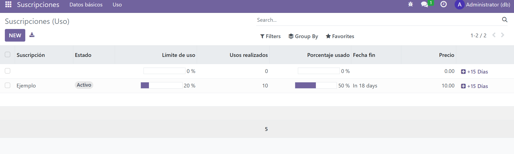

# PR0604: Vista de tipo lista

En primer lugar he creado el modelo subscription en el cual he ido metiendo los diferentes tipos de campos que me ha pedido el profesor 

he de destacar las funciones para calcular datos y asignarles de esta forma valores a ciertos campos. 

```python

 def _compute_duration_months(self):
        for record in self:
            if record.start_date and record.end_date:
                delta = relativedelta(record.end_date, record.start_date)
                record.duration_months = delta.years * 12 + delta.months
            else:
                record.duration_months = 0

    @api.depends("usage_limit", "current_usage")
    def _compute_use_percent(self):
        for record in self:
            if record.usage_limit > 0:
                record.use_percent = min((record.current_usage / record.usage_limit) * 100, 100)
            else:
                record.use_percent = 0.0

   
    def add_15_days(self):
        for record in self:
            if record.end_date:
                record.end_date += timedelta(days=15)
```

Es importante tambien saber que he dividido las views en tres archivos, uno para los básicos, otro para los de uso y otro para el menu.


A continuación voy a pasar todos los archivos del proyecto : 

## subscription.py

```python
# -*- coding: utf-8 -*-

from odoo import models, fields, api
from dateutil.relativedelta import relativedelta
from datetime import timedelta

class Subscription(models.Model):
    _name = 'subscription.subscription'
    _description = 'Suscripción'


    name = fields.Char("Nombre", required=True)
    customer_id = fields.Many2one("res.partner", string="Cliente", required=True)
    subscription_code = fields.Char("Código de suscripción", required=True)
    start_date = fields.Date("Fecha inicio", required=True)
    end_date = fields.Date("Fecha fin")
    duration_months = fields.Integer("Duración (meses)", compute="_compute_duration_months", store=True)
    renewal_date = fields.Date("Fecha renovación")
    status = fields.Selection(
        [('active', 'Activo'), ('expired', 'Expirado'), ('pending', 'Pendiente'), ('cancelled', 'Cancelado')],
        string="Estado"
    )
    is_renewable = fields.Boolean("Renovable")
    auto_renewal = fields.Boolean("Auto renovación")
    price = fields.Float("Precio")

   
    usage_limit = fields.Integer("Límite de uso")
    current_usage = fields.Integer("Uso actual")
    use_percent = fields.Float("Porcentaje usado", compute="_compute_use_percent", store=True)

    @api.depends("start_date", "end_date")
    def _compute_duration_months(self):
        for record in self:
            if record.start_date and record.end_date:
                delta = relativedelta(record.end_date, record.start_date)
                record.duration_months = delta.years * 12 + delta.months
            else:
                record.duration_months = 0

    @api.depends("usage_limit", "current_usage")
    def _compute_use_percent(self):
        for record in self:
            if record.usage_limit > 0:
                record.use_percent = min((record.current_usage / record.usage_limit) * 100, 100)
            else:
                record.use_percent = 0.0

   
    def add_15_days(self):
        for record in self:
            if record.end_date:
                record.end_date += timedelta(days=15)
```

## basic.xml
```xml
<odoo>
    <data>
        <record id="view_subscription_tree_basic" model="ir.ui.view">
            <field name="name">subscription.subscription.tree.basic</field>
            <field name="model">subscription.subscription</field>
            <field name="arch" type="xml">
                <tree string="Suscripciones - Básico">
                    <field name="name"/>
                    <field name="customer_id"/>
                    <field name="subscription_code"/>
                    <field name="start_date"/>
                    <field name="end_date"/>
                    <field name="duration_months"/>
                    <field name="renewal_date"/>
                    <field name="status"/>
                    <field name="is_renewable"/>
                    <field name="auto_renewal"/>
                    <field name="price"/>
                </tree>
            </field>
        </record>

        <record id="action_subscription_basic" model="ir.actions.act_window">
            <field name="name">Suscripciones (Básico)</field>
            <field name="res_model">subscription.subscription</field>
            <field name="view_mode">tree,form</field>
            <field name="view_id" ref="view_subscription_tree_basic"/>
        </record>
    </data>
</odoo>
```

## use.xml

```xml

<odoo>
    <data>
        <record id="view_subscription_tree_usage" model="ir.ui.view">
            <field name="name">subscription.subscription.tree.usage</field>
            <field name="model">subscription.subscription</field>
            <field name="arch" type="xml">
                <tree string="Suscripciones - Uso"
                      decoration-danger="status == 'expired'"
                      decoration-warning="status == 'cancelled'"
                      limit="15">

                    <field name="name" string="Suscripción"/>
                    <field name="status" widget="badge"/>

                    <field name="usage_limit" string="Límite de uso" widget="progressbar"/>
                    <field name="current_usage" string="Usos realizados" avg="Media de Uso"/>

                    <field name="use_percent" string="Porcentaje usado"
                           widget="progressbar"
                           decoration-danger="use_percent &gt; 80"/>

                    <field name="end_date" string="Fecha fin" widget="remaining_days"/>

                    <field name="price" string="Precio"
                           attrs="{'invisible': [('status', '=', 'cancelled')]}"/>

                    <button name="add_15_days"
                            string="+15 Días"
                            type="object"
                            icon="fa-plus-square"/>
                </tree>
            </field>
        </record>

        <record id="action_subscription_usage" model="ir.actions.act_window">
            <field name="name">Suscripciones (Uso)</field>
            <field name="res_model">subscription.subscription</field>
            <field name="view_mode">tree,form</field>
            <field name="view_id" ref="view_subscription_tree_usage"/>
        </record>
    </data>
</odoo>
```

## menu.xml

```xml
<odoo>

     <menuitem id="menu_subscription_root"
              name="Suscripciones"/>

   
    <menuitem id="menu_subscription_basic"
              name="Datos básicos"
              parent="menu_subscription_root"
              action="action_subscription_basic"/>

   
    <menuitem id="menu_subscription_usage"
              name="Uso"
              parent="menu_subscription_root"
              action="action_subscription_usage"/>

</odoo>
```

A continuacion esta es una foto de como se muestran los datos al usar el modulo : 
