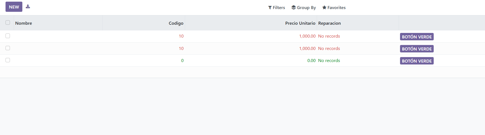

# Gestión de un taller mecánico


En primer lugar estos son los distintos modelos 

## Modelo Cliente

```py
# -*- coding: utf-8 -*-

from odoo import models, fields, api


class Cliente(models.Model):
    _name = 'taller.cliente'
    _description = 'taller.cliente'

    name = fields.Char()
    telefono = fields.Integer()
    email = fields.Char()
    direccion = fields.Char()

    vehiculos = fields.One2many(
        "taller.vehiculo",
        "cliente_id",
        string = "vehiculos"
    )
    
    def accion_verde(self):
        return True

```

## modelo Pieza
```py
# -*- coding: utf-8 -*-

from odoo import models, fields, api


class Pieza(models.Model):
    _name = 'taller.pieza'
    _description = 'taller.pieza'

    nombre = fields.Char()
    codigo = fields.Integer()
    precio_unitario = fields.Float()

    reparacion_id = fields.Many2many(
        "taller.reparacion",
    )
```
## modelo Reparación

```py 
# -*- coding: utf-8 -*-

from odoo import models, fields, api


class Reparacion(models.Model):
    _name = 'taller.reparacion'
    _description = 'taller.reparacion'

    fecha_inicio = fields.Date()
    fecha_fin = fields.Date()
    descripcion = fields.Char()
    
    estado = fields.Selection(
        selection=[('borrador', 'borrador'),
                    ('en curso', 'en curso'),
                    ("finalizada","finalizada")]
    )


    vehiculo_id = fields.Many2one(
        "taller.vehiculo"
    )
    tecnico_id = fields.Many2one(
        "res.users"
    )

    pieza_id = fields.Many2many(
        "taller.pieza"
    )
    
    coste_total = fields.Float(compute = "_total")

    @api.depends("pieza_id")
    def _total (self):
        for record in self: 
            record.coste_total = 0
            for a in record.pieza_id:
                 record.coste_total += a.precio_unitario

```

## modelo vehículo
```py
# -*- coding: utf-8 -*-

from odoo import models, fields, api


class Vehiculo(models.Model):
    _name = 'taller.vehiculo'
    _description = 'taller.vehiculo'

    matricula = fields.Char()
    marca = fields.Char()
    modelo = fields.Char()
    anio = fields.Integer()
    

    cliente_id = fields.Many2one(
        "taller.cliente"
    )

    reparaciones = fields.One2many(
        "taller.reparacion",
        "vehiculo_id",
        string="reparaciones"
    )

```

## Views

``` xml
<odoo>
    <data>
        <record model="ir.ui.view" id="taller.listCliente">
            <field name="name">taller list</field>
            <field name="model">taller.cliente</field>
            <field name="arch" type="xml">
                <tree editable = "bottom">
                <field name="name"/>
                <field name="telefono" />
                <field name="email"/>
                <field name="direccion"/>
                <field name="vehiculos"/>
                </tree>
            </field>
        </record>

        <record model="ir.actions.act_window" id="action_cliente">
            <field name="name">taller window</field>
            <field name="res_model">taller.cliente</field>
            <field name="view_mode">tree,form</field>
         </record>
    </data>
</odoo>

<odoo>
    <data>
    <record model="ir.ui.view" id="taller.listPieza">
      <field name="name">taller list</field>
      <field name="model">taller.pieza</field>
      <field name="arch" type="xml">
        <tree editable="bottom" 
              decoration-success="precio_unitario &lt; 10" 
              decoration-danger="precio_unitario &gt; 100">
          <field name="nombre" 
          attrs="{'invisible' :[('precio_unitario','=',1000.00)]}"
          />
          <field name="codigo" />
          <field name="precio_unitario"/>
          <field name="reparacion_id" />

          <button name="accion_verde" 
            string="Botón Verde" 
            type="object" 
            class="oe_highlight"/>
        </tree>
      </field>
    </record>
    <record model="ir.actions.act_window" id="action_pieza">
      <field name="name">taller window</field>
      <field name="res_model">taller.pieza</field>
      <field name="view_mode">tree,form</field>
    </record>
    </data>
</odoo>

<odoo>
    <data>
    <record model="ir.ui.view" id="taller.listReparacion">
      <field name="name">taller list</field>
      <field name="model">taller.reparacion</field>
      <field name="arch" type="xml">
        <tree editable="bottom">
          <field name="fecha_inicio" 
                 attrs="{'readonly': [('estado', '=', 'finalizada')]}"/>
          <field name="fecha_fin" 
                 attrs="{'readonly': [('estado', '=', 'finalizada')]}"/>
          <field name="descripcion" 
                 attrs="{'readonly': [('estado', '=', 'finalizada')]}"/>
          <field name="estado" 
                 decoration-muted="estado == 'borrador'" 
                 decoration-info="estado == 'en_curso'" 
                 decoration-success="estado == 'finalizada'"
                 attrs="{'readonly': [('estado', '=', 'finalizada')]}"/>
          <field name="vehiculo_id" 
                 attrs="{'readonly': [('estado', '=', 'finalizada')]}"/>
          <field name="tecnico_id" 
                 attrs="{'readonly': [('estado', '=', 'finalizada')]}"/>
          <field name="pieza_id" 
                 attrs="{'readonly': [('estado', '=', 'finalizada')]}"/>
          <field name="coste_total" 
                 decoration-danger="coste_total &gt; 500"
                 decoration-warning="coste_total &gt;= 100 and coste_total &lt;= 500"
                 decoration-success="coste_total &lt; 100"
                 attrs="{'readonly': [('estado', '=', 'finalizada')]}"/>
          
          <!-- Botones de estado -->
          <button name="action_abrir_reparacion" 
                  string="Abrir reparación" 
                  type="object" 
                  class="oe_highlight"
                  attrs="{'invisible': [('estado', '!=', 'borrador')]}"/>
          
          <button name="action_cerrar_reparacion" 
                  string="Cerrar reparación" 
                  type="object" 
                  class="oe_highlight"
                  attrs="{'invisible': [('estado', '!=', 'en_curso')]}"/>
          
          <button name="action_reabrir" 
                  string="Reabrir" 
                  type="object" 
                  attrs="{'invisible': [('estado', '!=', 'finalizada')]}"/>
        </tree>
      </field>
    </record>
    
    <record model="ir.actions.act_window" id="action_reparacion">
      <field name="name">taller window</field>
      <field name="res_model">taller.reparacion</field>
      <field name="view_mode">tree,form</field>
    </record>
    </data>
</odoo>

<odoo>
    <data>
    <record model="ir.ui.view" id="taller.listVehiculo">
      <field name="name">taller list</field>
      <field name="model">taller.vehiculo</field>
      <field name="arch" type="xml">
        <tree editable = "bottom">
          <field name="matricula"/>
          <field name="marca"/>
          <field name="modelo"/>
          <field name="anio"/>
          <field name="cliente_id"/>
          <field name="reparaciones"/>
        </tree>
      </field>
    </record>
    
    <record model="ir.actions.act_window" id="action_vehiculo">
      <field name="name">taller window</field>
      <field name="res_model">taller.vehiculo</field>
      <field name="view_mode">tree,form</field>
    </record>
    
    </data>
</odoo>
```

Ejemplo de uso 


    